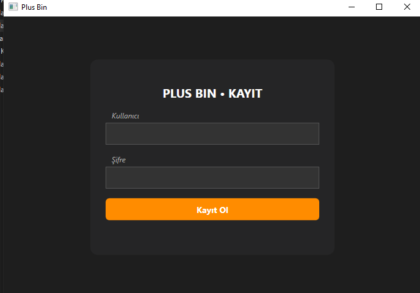
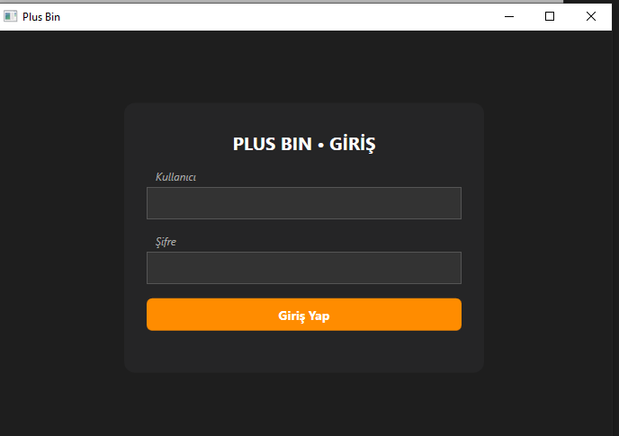
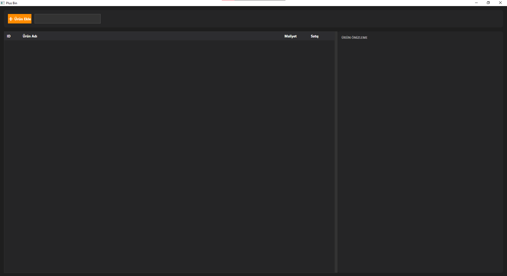
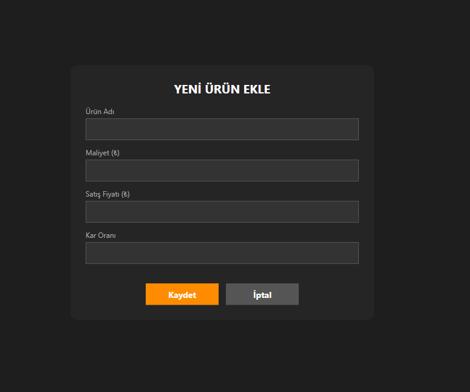

# Simple Inventory App

Modern ve kullanıcı dostu bir envanter yönetim uygulaması. C# WPF teknolojisi ile geliştirilmiş bu uygulama, kullanıcıların ürün envanterlerini güvenli ve etkili bir şekilde yönetmelerine olanak tanır.

## 📸 Ekran Görüntüleri

### Kayıt Ekranı

*Yeni hesap oluşturarak envanter yönetimine başlayın*

### Giriş Ekranı

*Mevcut kullanıcılar için güvenli giriş*

### Envanter Yönetim Paneli

*Tüm ürünlerinizi tek bir yerden görüntüleyin ve yönetin*

### Ürün Ekleme Ekranı

*Envanterinize kolayca yeni ürünler ekleyin*

## ✨ Özellikler

- **Kullanıcı Kimlik Doğrulama**: Güvenli kayıt ve giriş sistemi
- **Ürün Yönetimi**: Ürün ekleme, düzenleme ve silme işlemleri
- **Şifre Güvenliği**: Şifreler hash'lenerek güvenli bir şekilde saklanır
- **SQLite Veritabanı**: Yerel veritabanı ile hızlı ve güvenilir veri saklama
- **Modern Arayüz**: WPF ile tasarlanmış temiz ve sezgisel kullanıcı arayüzü
- **Ürün Detayları**: Ürün adı, miktarı, fiyatı ve kategorisi takibi
- **Arama ve Filtreleme**: Envanterinizdeki ürünleri hızlıca bulun

## 🚀 Kullanılan Teknolojiler

- **C# (.NET)**: Ana programlama dili
- **WPF (Windows Presentation Foundation)**: Kullanıcı arayüzü framework'ü
- **XAML**: UI tasarımı için markup dili
- **SQLite**: Hafif ve güçlü veritabanı çözümü
- **Entity Framework Core**: Veritabanı işlemleri için ORM
- **BCrypt / Password Hashing**: Güvenli şifre saklama

## 📋 Gereksinimler

Uygulamayı çalıştırmadan önce aşağıdakilerin yüklü olduğundan emin olun:

- **Windows 10** veya daha yeni sürüm
- **.NET 6.0 SDK** veya daha yeni
- **Visual Studio 2022** (önerilen) veya Visual Studio Code
  - Visual Studio ile geliştirme yapıyorsanız ".NET desktop development" workload'ının yüklü olması gerekir

## 🛠️ Kurulum

1. **Projeyi klonlayın**
   ```bash
   git clone https://github.com/FarmerDevv/Simple-inventory-app.git
   cd Simple-inventory-app
   ```

2. **Visual Studio ile açın**
   - `plusbin.sln` dosyasını Visual Studio ile açın

3. **NuGet paketlerini geri yükleyin**
   - Visual Studio otomatik olarak NuGet paketlerini geri yükleyecektir
   - Veya Solution Explorer'da projeye sağ tıklayıp "Restore NuGet Packages" seçeneğini kullanın

4. **Projeyi derleyin**
   - `Build` → `Build Solution` (Ctrl+Shift+B)

5. **Uygulamayı çalıştırın**
   - `Debug` → `Start Debugging` (F5)
   - veya `Start Without Debugging` (Ctrl+F5)

## 📦 Veritabanı Yapısı

Uygulama otomatik olarak SQLite veritabanı oluşturur ve aşağıdaki tabloları içerir:

### Users Tablosu
- **Id**: Benzersiz kullanıcı kimliği
- **Username**: Kullanıcı adı
- **PasswordHash**: Hash'lenmiş şifre
- **Email**: E-posta adresi
- **CreatedAt**: Hesap oluşturma tarihi

### Products Tablosu
- **Id**: Benzersiz ürün kimliği
- **Name**: Ürün adı
- **Category**: Ürün kategorisi
- **Quantity**: Stok miktarı
- **Price**: Ürün fiyatı
- **UserId**: Ürünü ekleyen kullanıcı (Foreign Key)
- **CreatedAt**: Ürün ekleme tarihi
- **UpdatedAt**: Son güncelleme tarihi

## 🗂️ Proje Yapısı

```
Simple-inventory-app/
├── Views/
│   ├── MainWindow.xaml/cs         # Ana pencere
│   ├── LoginView.xaml/cs          # Giriş ekranı
│   ├── RegisterView.xaml/cs       # Kayıt ekranı
│   ├── InventoryView.xaml/cs      # Envanter yönetim ekranı
│   └── AddProductView.xaml/cs     # Ürün ekleme ekranı
├── Models/
│   └── Product.cs                 # Ürün model sınıfı
├── Data/
│   ├── DatabaseManager.cs         # Veritabanı yönetimi
│   └── PasswordHasher.cs          # Şifre hash işlemleri
├── App.xaml/cs                    # Uygulama başlangıç noktası
├── plusbin.csproj                 # Proje dosyası
└── plusbin.sln                    # Solution dosyası
```

## 💻 Kullanım

1. **İlk Kullanım**
   - Uygulamayı ilk kez çalıştırdığınızda kayıt ekranı açılır
   - Kullanıcı adı, e-posta ve şifre ile yeni bir hesap oluşturun

2. **Giriş Yapma**
   - Kayıtlı kullanıcı adınız ve şifrenizle giriş yapın

3. **Ürün Ekleme**
   - "Ürün Ekle" butonuna tıklayın
   - Ürün bilgilerini (ad, kategori, miktar, fiyat) girin
   - "Kaydet" butonuna basın

4. **Ürün Yönetimi**
   - Envanter listesinden ürünleri görüntüleyin
   - Ürünleri düzenleyin veya silin
   - Stok miktarlarını güncelleyin

## 🔒 Güvenlik

- Kullanıcı şifreleri **BCrypt** algoritması ile hash'lenerek saklanır
- Düz metin şifreler veritabanında asla saklanmaz
- Her kullanıcı sadece kendi ürünlerini görebilir ve yönetebilir
- SQL Injection saldırılarına karşı parametrize sorgular kullanılır

## 🐛 Bilinen Sorunlar / Sınırlamalar

- Uygulama şu anda sadece Windows platformunda çalışmaktadır
- Tek kullanıcılı oturum (aynı anda birden fazla kullanıcı girişi yapılamaz)
- Çevrimdışı kullanım için tasarlanmıştır (online senkronizasyon yok)

## 🚀 Gelecek Güncellemeler

- [ ] Excel'e dışa aktarma
- [ ] Gelişmiş arama ve filtreleme
- [ ] Çoklu dil desteği
- [ ] Tema seçenekleri (Light/Dark mode)
- [ ] Rapor ve analitik özellikleri

## 🤝 Katkıda Bulunma

Katkılarınızı memnuniyetle karşılıyoruz! Pull request göndermekten çekinmeyin.

1. Projeyi fork edin
2. Yeni bir branch oluşturun (`git checkout -b feature/YeniOzellik`)
3. Değişikliklerinizi commit edin (`git commit -m 'Yeni özellik eklendi'`)
4. Branch'inizi push edin (`git push origin feature/YeniOzellik`)
5. Bir Pull Request açın


## 👤 Geliştirici

**FarmerDevv**

- GitHub: [@FarmerDevv](https://github.com/FarmerDevv)
- Proje: [Simple-inventory-app](https://github.com/FarmerDevv/Simple-inventory-app)


---

💙 **Made with C# and WPF by FarmerDevv**
